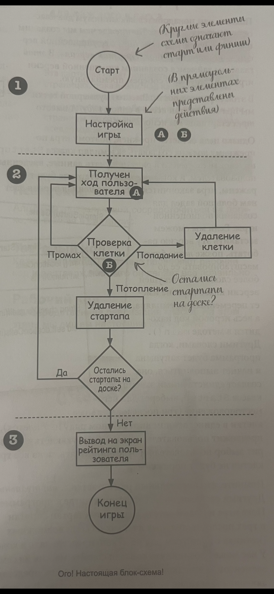
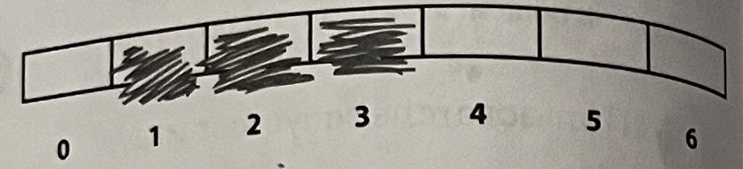
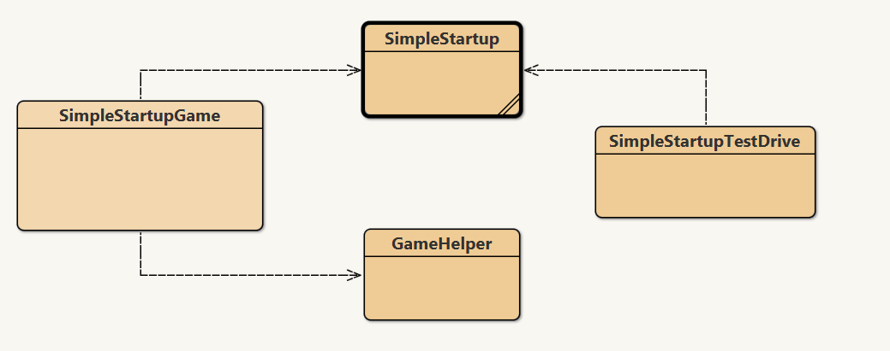

# Игра в стиле Морского боя (Битва за рынок)

- Будем создавать игру на подобии морского боя
  > Суть игры: есть доска размером 7х7. На данном поле расположены 3 слова (это название стартапов из силиконовой долиныу). Задача игрока ввести координаты поля (A3, C5) - где первая буква - это строка а цифра - столбец (как в Excel). После передачи координат - получаем один из рещультатов (попал, мимо, потопил)
- [Блок-схема] 

# Game_lite

- Это упрощенная версия игры
- У нас будет 1 стартап и 1 строка из 3 символов (пока без матриц чтобы не усложнять)
  
- Строка состоит из 7 клеток
- Необязательно создавать ряд из 7 значений - нам достаточно только из 3, где ,где будут перечислены координаты диапозона - например [0-1-2]
- Игра состоит из 1 класса: `Startup` с main() функцией

## Разработка класса

- Пишем классы по сценария `Псевдокод` - `Тестовый код` - `Рабочий код`
- `Псевдокод` - алгоритм, позволяюзий сосредоточиться на логике, не вникая в синтаксис
- `Тестовый код `- Класс и методы, которые проверяют раьочий код и подтверждают. что он делает все правильно
- `Рабочий код` - Непосредственная реализация класса. (код на Java)
- Мы определились с именами методов и их параметрами
- Написали класс SimpleStartupTestDrive.java для тестирования данных методов
- Напимали наш основной класс Написали класс SimpleStartup.java
- После запускаем SimpleStartupTestDrive.java - пока не получим что тесты пройдены

> Псевдокод класса SimpleStartupGame

---

```java
public static void main(String[] args)
  ОБЪЯВЛЯЕМ целочисленную переменную для хранения количества ходов пользователя, присвоим  ей имя numOfGuess и значение 0
  СОЗДАЕМ новый экземпляр класса SimpleStartup
  ВЫЧИСЛЯЕМ случайное число от 0 до 4, которое будет позицией начальной клетки
  СОЗДАЕМ целочисленный массив с 3 элементами, используя случайно сгенерированное число, это число +1 и это число +2 ( прим. 3,4,5)
  ВЫЗЫВАЕМ метод setLocationCells() из класса SimpleStartup
  ОБЪЯВЛЯЕМ логическую переменную isAlive, представляющее состояние игры. ПРИСВАИВАЕМ ей значение true

  ПОКА стартап не потоплен (isAlive == true):
    ПОЛУЧАЕМ пользовательский ввод из командной строки
    //ПРОВЕРЯЕМ предположеие пользователя
    ВЫЗЫВАЕМ метод checkYourself() из экземпляра SimpleStartup
    ИНКРЕМЕНТИРУЕМ переменную numOfGuess
    // ПРОВЕРЯЕМ потопдение стартапа
    ЕСЛИ результат - "потопил"
     ПРИСВАИВАЕМ переменной isAlive значение false
     ВЫВОДИМ количество ходов пользователя
    КОНЕЦ ВЕТВЛЕНИЯ
  КОНЕЦ ЦИКЛА WHILE
КОНЕЦ МЕТОДА
```

---
- Диаграмма классов

---
- Отвлечение на написание псевдокода переключает полушария мозга (так мы можем переключаться ими по 30 минут - чтобы не утомлять его только в 1 части) Чередуем творчество с логикой.
- SimpleStartupGame содержит код Java переведенный из ПСЕВДОКОДА
- Он использует класс SimpleStartup (для методов setLocationCells() и checkYourself())
- Класс SimpleStartupTestDrive использует класс SimpleStartup где мы тестировали методы этого класса

---
### Доп. материаk из встречающегося кода
- В java классы можно группировать по пакетам
- Пакеты это что то вроде иерархии папок для группировки классов по смыслу
- Пользовательские классы из пакетов - отличных от местопрложеия текущего класса нужно испортировать через ключевое слово `import имя_пакета.имя_класса;`
- `Math.random()` это класс встроенный в Java. Поэтому и не требует прописания import - компилятор сам его найдет и подставит.

```java
int randomNum = int() (Math.random() * 5) 
// int() приводит в тип int выражение справа (например отброс всего после запятой) - `приведение примитивов`
// Math.random() возвращает значение от 0.0 до 1.0
// Умножаем на 5 чтобы получить число от 1 до 5
``` 

- В java чтобы использовать методы класса - можно создать его экземпляр. 
```java 
 GameHelper helper = new GameHelper();
```

- Увеличение/уменьшение значения переменной на 1 (итерация)
```java
int x = 0;
x ++; // теперь x = 1
x --; // теперь x снова = 0
// Расположение ++ b -- может повлиять на результат.
int a = 0;
int b = 0;
int y = ++a;  // z = 1 а b = 1 
int z = b++;  // z = 0 а b = 1 
```

- Улучшенный цикл for для массивов и коллекций
```java
// Появилась с версии Java 5.0
for (String name: nameArray) {
  // String name - итерационная переменная
  // nameArray - коллекция элементов
  // Перебирает все элементы коллекции. Тип итерационной переменной должен соответствовать типам анных коллекции
}
```